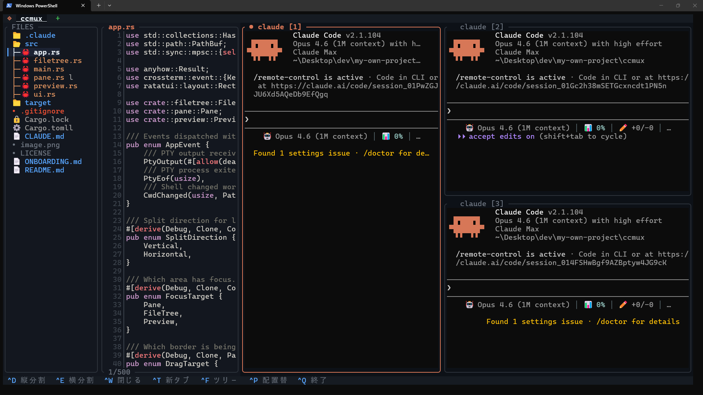

# glowmux

Manage multiple Claude Code or shell sessions in one Rust TUI.



## What it does

- Split one terminal into multiple PTY panes
- Keep separate tab workspaces
- Show a file tree for the active workspace directory
- Preview text files, images, and git diffs
- Track pane working directories through OSC 7 updates
- Can save and restore session snapshots in the config directory when session support is enabled

## Build and run

```bash
cargo build --release
cargo run
```

You can also start in a specific directory:

```bash
glowmux /path/to/project
```

Nested glowmux sessions are blocked. If `GLOWMUX` is already set, the app exits instead of starting inside an existing pane.

## Configuration

glowmux loads its runtime config from `dirs::config_dir()/glowmux/config.toml`.
On common setups that usually resolves to:

- Linux: `~/.config/glowmux/config.toml`
- macOS: `~/Library/Application Support/glowmux/config.toml`
- Windows: `%AppData%\glowmux\config.toml`

Keys you omit fall back to the built-in defaults from `src/config.rs`.

This repo also includes `setting.sample.toml`. Keep that filename in the repo, then copy it to your runtime path as `config.toml`.

```bash
# Linux example
mkdir -p ~/.config/glowmux
cp setting.sample.toml ~/.config/glowmux/config.toml
```

Session data is stored separately at `<config-dir>/glowmux/session.json`.

## Claude Code hooks

glowmux can listen for Claude Code hook events on a local Unix socket and use them to color each pane independently.

The repo includes a small forwarder at `scripts/claude-hooks/glowmux-forwarder.py`.
It reads the Claude hook payload from stdin, adds `pane_id` from `GLOWMUX_PANE_ID`, then forwards the JSON to glowmux's socket.

The script is safe to leave installed even when glowmux is not running.
If there is no `GLOWMUX_PANE_ID`, no socket, or no valid JSON on stdin, it exits quietly.

### 1. Pick an absolute path to the forwarder

Use an absolute path in Claude Code config.
On macOS and Linux, this is usually easiest with `python3`:

```bash
python3 /absolute/path/to/glowmux/scripts/claude-hooks/glowmux-forwarder.py
```

If your path contains spaces, keep the full command as one valid JSON string in Claude Code config.

### 2. Register the hook in Claude Code

Add this to your Claude Code `settings.json` hooks section:

```json
{
  "hooks": {
    "Stop": [
      {
        "hooks": [
          {
            "type": "command",
            "command": "python3 /absolute/path/to/glowmux/scripts/claude-hooks/glowmux-forwarder.py"
          }
        ]
      }
    ],
    "Notification": [
      {
        "matcher": "permission_prompt",
        "hooks": [
          {
            "type": "command",
            "command": "python3 /absolute/path/to/glowmux/scripts/claude-hooks/glowmux-forwarder.py"
          }
        ]
      }
    ],
    "PreToolUse": [
      {
        "matcher": "*",
        "hooks": [
          {
            "type": "command",
            "command": "python3 /absolute/path/to/glowmux/scripts/claude-hooks/glowmux-forwarder.py"
          }
        ]
      }
    ],
    "UserPromptSubmit": [
      {
        "hooks": [
          {
            "type": "command",
            "command": "python3 /absolute/path/to/glowmux/scripts/claude-hooks/glowmux-forwarder.py"
          }
        ]
      }
    ]
  }
}
```

Claude Code passes the hook payload as JSON on stdin.
glowmux accepts either `event` or `hook_event_name`, along with `session_id` and `transcript_path` when Claude provides them.

The `Notification` hook uses `matcher: "permission_prompt"` rather than an empty matcher.
Using an empty matcher would fire on every internal notification Claude Code emits (tool results, sub-agent calls, etc.), causing constant `Waiting` state flicker in glowmux.
Restricting to `permission_prompt` ensures glowmux only enters the yellow waiting state when Claude is actually blocked on user approval.

### 3. Start Claude inside a glowmux pane

glowmux injects `GLOWMUX_PANE_ID` into each pane process.
As long as Claude starts inside that pane, the forwarder can attach the hook event to the correct pane.

### 4. Socket path

The forwarder sends to the same runtime socket that glowmux opens:

- Linux: `$XDG_CONFIG_HOME/glowmux/hooks.sock`, or `~/.config/glowmux/hooks.sock` when `XDG_CONFIG_HOME` is not set
- macOS: `~/Library/Application Support/glowmux/hooks.sock`

Windows is not covered by this helper yet because the current runtime uses a Unix socket.

### Important config notes

- `ai.gemini.api_key` is read when glowmux loads the config, but app saves never write it back
- `session.save_path` exists in the config schema, but the current runtime still saves and loads `<config-dir>/glowmux/session.json`
- Session restore runs before startup panes. If restore succeeds, startup panes are skipped
- Session saving currently happens on clean exit when `session.enabled = true`
- `session.auto_save`, `session.save_interval`, and `session.restore_claude` exist in the schema, but they are not currently wired into runtime behavior
- The app can run with no config file at all. `config.toml` is only created when glowmux saves settings for you
- See `setting.sample.toml` for the full commented template and defaults

## Keybindings

Configurable defaults come from `KeybindingsConfig::default()` in `src/config.rs`. A few context-specific bindings such as `Alt+S`, `Alt+1..9`, and `Ctrl+Left` / `Ctrl+Right` are handled directly in the app.

### Pane focus keys

These defaults work while pane focus is active.

| Key | Action |
|---|---|
| `Ctrl+D` | Split vertically |
| `Ctrl+E` | Split horizontally |
| `Ctrl+W` | Close focused preview, pane, or tab |
| `Ctrl+N` | Open the pane creation dialog |
| `Ctrl+T` | New tab |
| `Alt+Left` / `Alt+Right` | Previous / next tab |
| `Alt+1`..`Alt+9` | Jump to tab |
| `Alt+R` | Rename current tab |
| `Alt+H` / `Alt+J` / `Alt+K` / `Alt+L` | Move focus between panes by direction |
| `Alt+[` / `Alt+]` | Previous / next pane |
| `Ctrl+Left` / `Ctrl+Right` | Cycle focus across file tree, preview, and panes |
| `Ctrl+F` | Toggle file tree or move focus to it |
| `Ctrl+P` | Swap preview and pane columns |
| `Ctrl+L` | Open layout picker when more than one pane exists |
| `Alt+Z` | Zoom the focused pane, or the preview when preview has focus |
| `Ctrl+Y` | Copy visible content from the focused pane |
| `Alt+A` | Toggle AI title generation |
| `Ctrl+,` | Open the numeric settings panel |
| `?` | Open the feature toggle panel, pane focus only |
| `Alt+S` | Toggle the status bar for the current run |
| `Ctrl+Q` | Quit |

### Prefix key

The default prefix is `Ctrl+B`.

After pressing the prefix:

| Key | Action |
|---|---|
| `q` | Quit |
| `Space` | Cycle layout mode |
| `[` | Enter copy mode |
| `w` | Open the pane list overlay |
| `Ctrl+B` again | Pass the prefix key through to the PTY |

Copy mode is pane-only. It uses vim-like movement keys such as `h`, `j`, `k`, `l`, `g`, `G`, `v`, `V`, `Ctrl+U`, `Ctrl+D`, then `y` or `Enter` to copy.

### File tree keys

The file tree is context-specific. These keys work when file tree focus is active.

| Key | Action |
|---|---|
| `j` / `k` or arrows | Move selection |
| `Ctrl+D` / `Ctrl+U` | Scroll 5 lines |
| `Enter` or `o` | Expand or collapse a directory, or act on a file |
| `.` | Toggle hidden files |
| `d` | Load the selected file and show its git diff, only when `features.diff_preview = true` |
| `Esc` | Return focus to panes, keep preview open |
| `Ctrl+F` | Close the file tree when it has focus |

Important file tree behavior:

- Hidden files are shown by default
- `.git` is always hidden
- Directories expand and collapse lazily
- The file tree follows the focused pane. If panes point at different subdirectories, repositories, or worktrees, the file tree and git badges rebind to that pane context.
- Git badges are pane-scoped and use compact markers: `M` modified, `+` added, `-` deleted, `→` renamed, `?` untracked, `◌` ignored, `!` conflicted.
- `filetree.enter_action` decides what `Enter` does for files:
  - `preview`: open preview and move focus to the preview
  - `editor` or `neovim`: send the editor command to the focused pane shell
  - `choose`: open a small action picker with preview or editor
- `filetree.editor` is the command name used by editor mode. The default is `nvim`

### Preview keys

These keys work when preview focus is active.

| Key | Action |
|---|---|
| `j` / `k` or arrows | Scroll vertically |
| `Ctrl+D` / `Ctrl+U` | Scroll 5 lines |
| `PageDown` / `PageUp` | Scroll by 20 lines |
| `h` / `l` or Left / Right | Scroll horizontally |
| `Home` | Reset horizontal scroll |
| `y` | Copy filename |
| `Y` | Copy full path |
| `Alt+Z` | Toggle preview zoom |
| `Ctrl+W` | Close preview |
| `Ctrl+P` | Swap preview and pane columns |
| `Ctrl+Left` / `Ctrl+Right` | Cycle focus back through panes and the file tree |
| `Ctrl+Q` | Quit |
| `Esc` | Return to file tree if visible, otherwise return to panes |

### Mouse

- Click a pane to focus it
- Click a tab to switch tabs
- Double-click a tab to start rename
- Click `+` in the tab bar to open a new tab
- Drag borders to resize the file tree, preview, or pane splits
- Scroll inside the file tree, preview, or pane history
- Drag across pane or preview text to select it. Releasing the mouse copies the selection to the clipboard

## Runtime behavior that matters

- The active workspace starts from your current directory, or from the directory passed on the command line
- For bash and zsh, glowmux injects OSC 7 directory updates so `cd` changes can update the workspace state automatically
- When the focused pane changes directory through OSC 7, glowmux updates the workspace cwd, rebuilds the file tree, updates the cwd-based tab name, and closes the preview
- Manual tab rename is session-only. It changes the displayed label for that run, but it is not persisted
- Session restore takes priority over startup panes
- Current session restore is limited. It recreates tabs, pane counts, and saved titles, but it does not fully restore pane cwd, saved layout mode, worktree metadata, or Claude relaunch state
- The file tree auto-refreshes while visible, so directory changes show up without reopening the app
- `Ctrl+C` copies the current text selection if one exists. Otherwise it is forwarded to the focused PTY as usual
- Closing a preview does not close the file tree
- Closing the file tree while it has focus moves focus to the preview if one is open, otherwise back to panes

## Preview limits and diff behavior

Preview behavior comes from `src/preview.rs`.

- Text preview reads up to 500 lines
- Text files larger than 10 MB are rejected
- Image files larger than 20 MB are rejected
- Binary files are detected from the first 8192 bytes and are not rendered as text
- Image preview is attempted for common image extensions such as `png`, `jpg`, `gif`, `webp`, `bmp`, `ico`, and `tiff`
- Diff preview runs pane-scoped `git diff HEAD -- <file>` for the selected file and shows the first 500 diff lines
- If `[preview].prefer_delta = true` and `delta` is installed, glowmux prefers delta-styled diff output for the embedded preview and falls back to plain git diff automatically when delta is unavailable or unsuitable
- If there is no diff, diff preview stays off and the app shows a status message

## In-app settings and feature toggles

`Ctrl+,` opens the settings panel. Today it edits only these numeric values:

- `terminal.scrollback`
- `layout.breakpoint_stack`
- `layout.breakpoint_split2`
- `ai_title_engine.update_interval_sec`
- `ai_title_engine.max_chars`

`?` opens the feature toggle panel, but only while pane focus is active. It edits and saves this exact list of booleans:

- `status_dot`
- `status_bg_color`
- `status_bar`
- `worktree`
- `worktree_ai_name`
- `file_tree`
- `file_preview`
- `diff_preview`
- `cd_tracking`
- `ai_title`
- `responsive_layout`
- `session_persist`
- `context_copy`
- `layout_picker`
- `startup_panes`
- `zoom`

Those dialogs save back to `config.toml`. Some of the saved booleans are active runtime toggles, while others are currently schema fields that are not enforced everywhere yet.
Hotkeys like `Alt+A` change runtime state immediately, but they do not write the config file by themselves.

## Configuration sections

The config file supports these top-level sections:

- `[features]`
- `[terminal]`
- `[layout]`
- `[startup]`
- `[[startup.panes]]`
- `[pane]`
- `[ai]`
- `[ai.title]`
- `[ai.worktree_name]`
- `[ai.ollama]`
- `[ai.gemini]`
- `[ai.claude_headless]`
- `[status]`
- `[worktree]`
- `[session]`
- `[keybindings]`
- `[ai_title_engine]`
- `[filetree]`

Use `setting.sample.toml` as the schema reference. It mirrors the current config schema from `src/config.rs` and includes the shipped defaults, including a few fields that are not fully wired into runtime behavior yet.

## Source map

```text
src/
├── main.rs
├── app.rs
├── config.rs
├── filetree.rs
├── pane.rs
├── preview.rs
└── session.rs
```

## License

MIT
